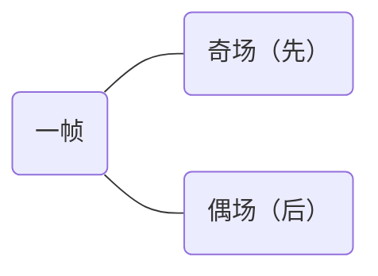
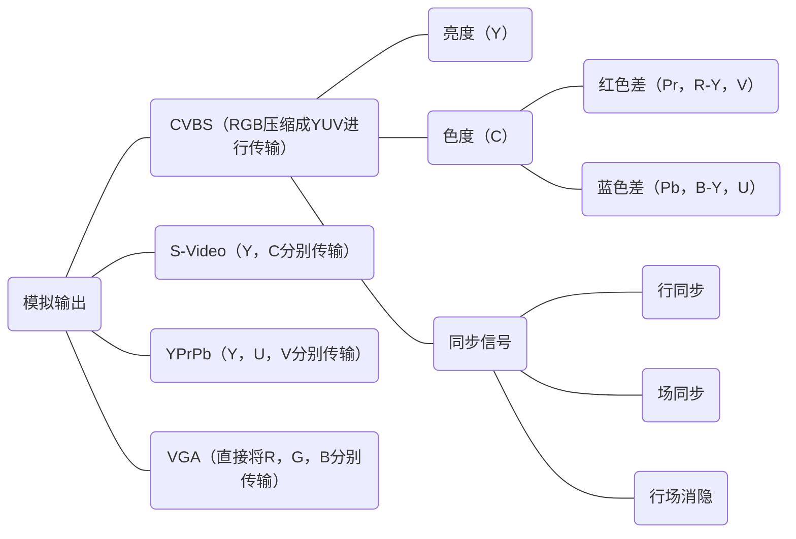
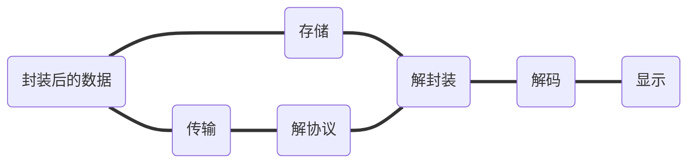
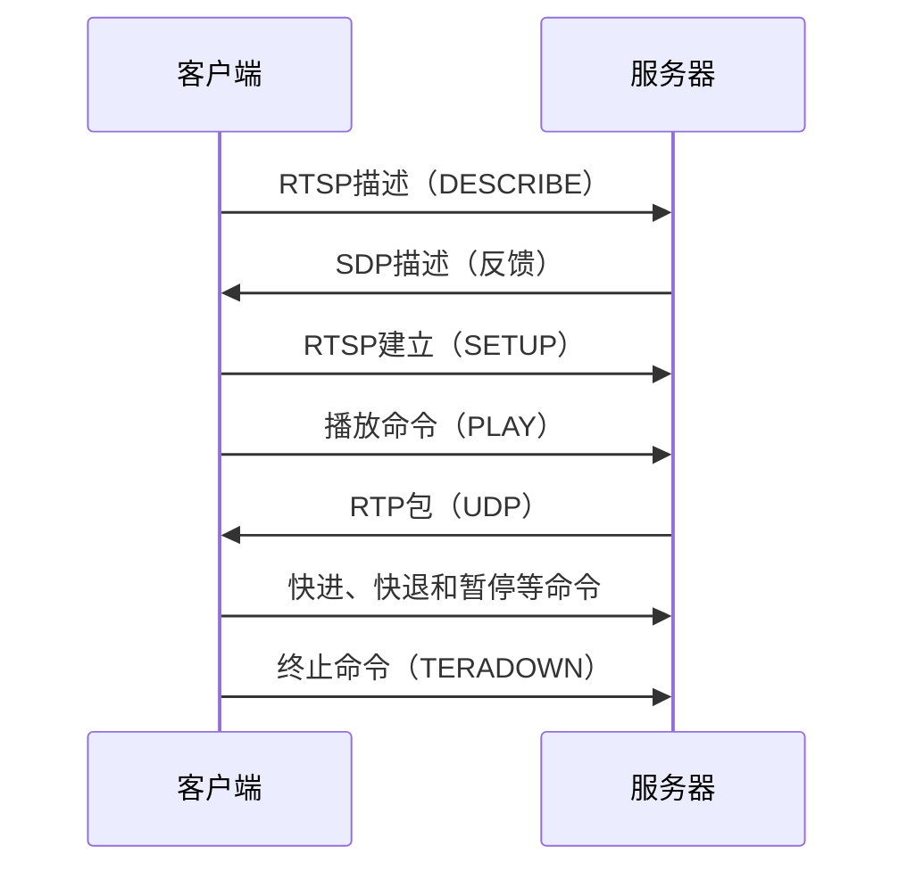
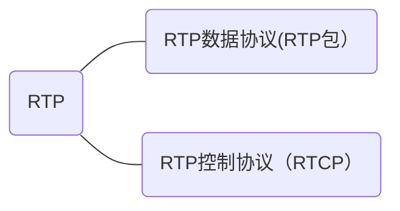
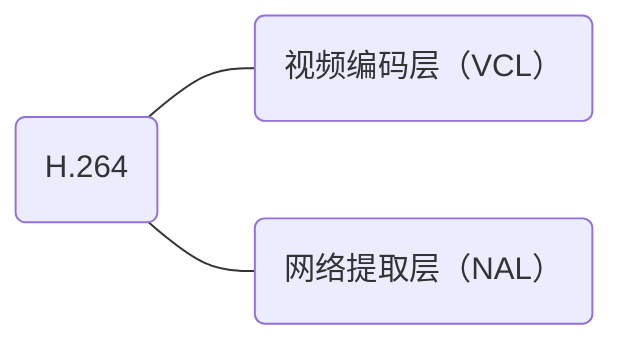
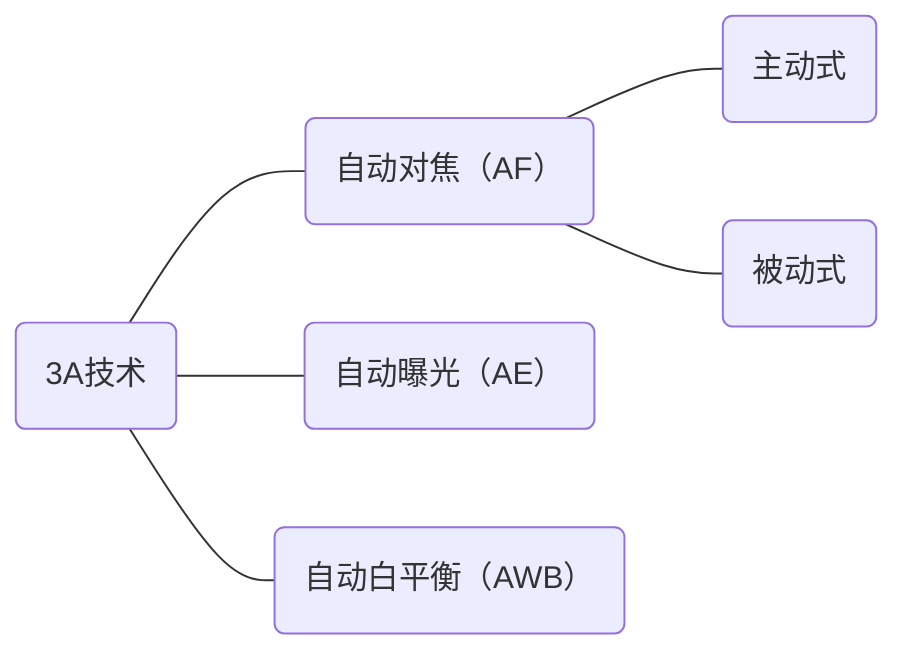

Hi3516A平台相机软件介绍
1. 整体架构
* 数据流
  - 镜头
  - sensor/a-codec
  - vi pipe/ai
  - vpss
    1) 远端码流
       - venc/aenc
       - h.264/.../g.711/...（编码）
       - ps/rtp/...（封装）
    2) 本地输出
       - vo
       - bt1120/.../pcm/...（封装）
         BT601是SDTV的数据结构 BT656是SDTV(1280x720P@60Hz)的interface PCLK+8bit Data
         BT709是HDTV的数据结构 BT1120是HDTV(1920x1080P@60Hz)的interface PCLK+12bit Data 或者 PCLK+16bit Data
       - sdi/hdmi/...（编码）
   - region
* 控制流
  - 机芯库
  - isp
  - dsp/研究院
  - app
* 构成
** 机芯/heop
   完整的数据流及部分控制流
** 全景/...（额外控制流）
    - pt（以及zfs联动部分）
    - menu
    - 协议/接入
    - 

2. 启动流程
1) daemon启动
   - 加密/快速启动
   - ipc通信
2) database
   - 参数保存
3) davinci/netprocess/..
   - 控制流（232/485/web/sdk/pt/..）通路
   - 能力集
   - 机芯库交互
   - 额外控制流（pt/mcu/..）通路
4) dsp
   - app交互（armlib）
   - 视频/音频/region
   - isp交互


扫描（SCAN）、花样（PATTERN）、巡航（PATROL）：https://zhidao.baidu.com/question/1371953268887787659.html

heop：https://www.hikvision.com/en/Partners/Embedded-Open-Platform
panorama - 全景

# draw

``` mermaid
graph LR
id01===id04("扫描")
id04===id07("彩色成像")
id07===id10("模拟信号")
id04===id10
id10===id11("模拟输出")
id10===|采样量化|id12("数字输出")
subgraph ""
id01("感光元件")---id02("CCD")
id01---id03("CMOS")
end
subgraph ""
id04---id05("逐行（场积累式）")
id04---id06("隔行（帧积累式）")
end
subgraph ""
id07---id08("三棱镜")
id07---id09("滤光片")
end
```





``` mermaid
graph LR
id01("数字输入")===id02("处理")
id02===id03("编码")
id03===id04("封装")
id04===id05("存储")
id04===id06("传输")
id05===id07("解封装")
id07===id08("解码")
id08===id09("显示")
id06===id10("解协议")
id10===id07
subgraph ""
id01---id11("视频")
id01---id12("音频")
end
subgraph ""
id02---id21("视频")
id02---id22("音频")
id21---id23("帧间")
id21---id24("帧内")
end
subgraph ""
id03---id31("视频")
id03---id32("音频")
end
```

``` mermaid
graph LR
id01("数字输入")===id02("处理")
id02===id03("编码（压缩）")
id03===id04("封装")
subgraph ""
id01---id11("视频")
id01---id12("音频")
end
subgraph ""
id02---id21("视频")
id02---id22("音频")
id21---id23("帧间")
id21---id24("帧内（图像处理）")
end
subgraph ""
id03---id31("视频")
id03---id32("音频")
end
```

``` mermaid
graph LR
id01("冗余信息")===id02("压缩编码")
subgraph ""
id01---id11("数据冗余（无损压缩）")
id01---id12("视觉冗余（有损压缩）")
end
subgraph ""
id02---id21("变换编码")
id02---id22("熵编码")
id02---id23("运动估计和运动补偿")
id21---id24("混合编码")
id22---id24
id23---id24
end
```

``` mermaid
graph LR
id01("冗余信息")===id02("压缩编码")
subgraph ""
id01---id11("频谱掩蔽效应")
id01---id12("时域掩蔽效应")
id12---id13("前掩蔽")
id12---id14("同时掩蔽")
id12---id15("后掩蔽")
end
```

``` mermaid
graph LR
id01("编码后的数据（ES流）")===id02("打包后的数据（PES流）")
id02===id03("视音频同步")
subgraph ""
id03---id31("显示时间标记（PTS）")
id03---id32("解码时间标记（DTS）")
end
```



``` mermaid
graph LR
id01("sample PCM（16位，调制编码）")===id02("PCM（8位，压缩）")
id02===id03("ADPCM（2~5位，自适应步长增量调制编码）")
id01===id03
subgraph ""
id02---id21("a-law")
id02---id22("u-law")
end
```







``` mermaid
graph LR
id01===id11("图像处理")
subgraph ""
id01("图像增强（预处理）")---id02("空域法")
id02---id03("点运算")
id02---id04("领域运算（模板运算）")
id01---id05("频域法")
id05---id06("傅里叶变换")
id05---id07("小波变换")
end
subgraph ""
id11("图像分析")---id12("pixel labeling")
id12---id13("threshold")
id12---id14("machine learning")
id12---id15("global optimization")
end

```


