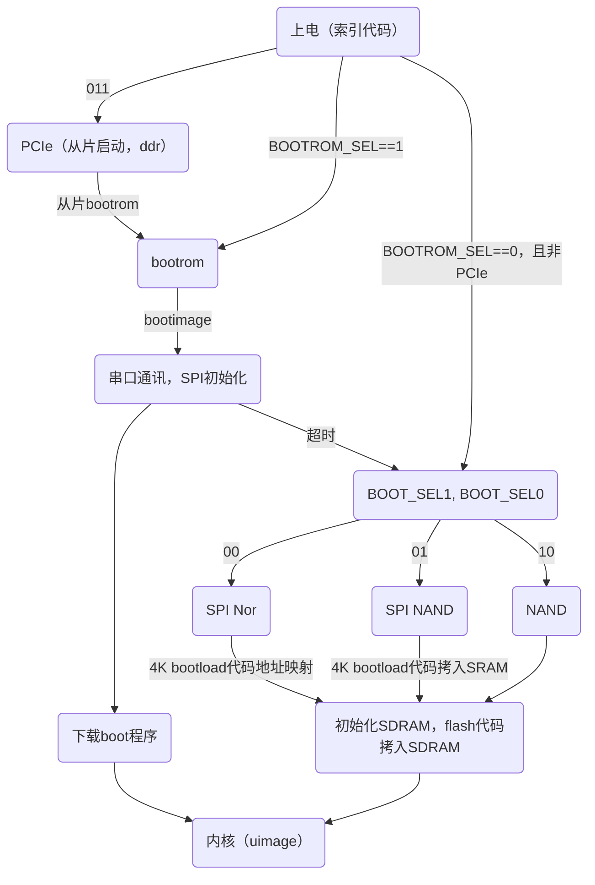

# Hi3531DV100 H.265编解码处理器

[TOC]

## 01. 图1-1 Hi3531DV100的典型应用场景（20180502）

* 视频分辨率：

|Format|Resolution(PAL)|Resolution(NTSC)|
|:---:|:---:|:---:|
|960H|960*576|960*480|
|D1|704*576|704*480|
|HD1|352*576|352*480|
|DCIF|528*384|528*320|
|2CIF|704*576|704*480|
|CIF|352*288|352*240|
|QCIF|176*144|176*120|

* PHY：Physical Layer Entity Sublayer，pci总线接mac总线，mac接phy（通过mii传送数据），phy接网线

## 02. 图1-2 Hi3531DV100芯片逻辑框图

* BT.656：ITU-R BT.656，数字视频信号标准，模转数，YUV422?

* VPSS：Video Process Sub-System，视频前处理单元
* VGS：Video Guarantee System，视频监控运行保障系统
* TDE?IVE?
* SSP：Synchronous Serial Pot，同步串行端口控制器
* I2S：Inter—IC Sound，集成电路内置音频总线

## 03. 1.3 启动模式

* SDRAM：同步动态随机存取存储器，memory
* SRAM：静态随机存取存储器，cache
* nor flash：非易失闪存，有地址总线，cpu可以直接取指运行程序，XIP（execute in place，芯片内执行）
* nand flash：非易失闪存，没有地址总线，cpu不能直接取指运行程序

* u-boot（通用的bootloader）启动流程：

>stage 1：
1>硬件设备初始化
2>为bootloader第二阶段准备RAM空间
3>复制bootloader第二阶段代码到RAM中
4>设置好stack
5>跳转到第二阶段代码的C入口点
stage 2：
1>初始化本阶段要使用到的硬件设备
2>检测系统内存映射
3>将内核映像和根文件系统映像从flash上读到RAM空间中
4>为内核设置启动参数
5>调用内核

## 04. 6.2 VEDU

* osd：On Screen Display

* 码率控制：

>码率（码流）：数据传输时单位时间传送的数据位数（kbps），文件体积=时间×码率/8
VBR：Variable Bitrate，动态码率
CBR：Constant Bitrate，固定码率。只能通过增大QP来减少码字大小
三码流：本地高清存储H.264，网络传输D1/CIF，手机QCIF

## 05. 8.2.1 概述

* ARGB_8888：每个像素占四位，即A=8，R=8，G=8，B=8，那么一个像素点占8+8+8+8=32位

## 06. 11.1.2 特点（20180503）

* 双沿采样：双边沿采样，上升沿下降沿均采样
* SMPTE：The Society of Motion Picture and Television Engineers，时间码概念
> * hours:minutes:seconds:frames，一段长度为00:02:31:15的视频片段的播放时间为2分钟31秒15帧，如果以每秒30帧的速率播放，则播放时间为2分钟31.5秒
> * 29.97fps与30fps
> 丢帧（drop-frame）格式，每分钟丢2帧（不显示）
不丢帧（nondrop-frame）格式，忽略时间码与实际播放帧之间的误差

## 07. 12.1 概述

* G711A/U：A-law/Mu-law编码方式的G711，16位sample压缩为8位
* G726：ITU的ADPCM（Adaptive differential pulse-code modulation，自适应步长）标准，8位（G711输出）/16位（sample）压缩为2~5位

## 08. 14.2.4 工作方式

* AMBA：Advanced Microcontroller Bus Architecture，高级处理器总线架构。ARM中典型的soc平台总线
* AXI：Advanced eXtensible Interface，高级可拓展接口。SoC系统中，均以AXI总线为主总线，通过桥连接AHB总线与APB总线，这样能够增加SoC系统的灵活性，更加合理地把不同特征IP分配到总线上
* APB：Advanced Peripheral Bus，高级外围总线。主要用在低速且低功率的外围，唯一主设备是APB桥（与AXI或APB相连），固定两个时钟周期完成一次读或写的操作

## 09. 14.3.4 三种外设总线时序

* 单工通信：只支持数据在一个方向上传输；
* 半双工通信：允许数据在两个方向上传输，但是，同一时刻只允许数据在一个方向上传输（切换方向的单工通信）；
* 全双工通信：允许数据同时在两个方向上传输（两个单工通信结合）

## 10. 14.4.2 特点

* IR协议：红外都是以38KHz作为载波频率，即每一位时间为1.12ms或2.25ms
> NEC with simple repeat code：start+data+burst（第一帧），简化start+data+简化burst（后续帧）
NEC with full repeat code
TC9012
松下7051码
SONY码
RC5/RC6A

## 11. 14.6 PCI Express

* PCI：Peripheral Component Interconnect，外设组件互连标准
> PCI Express总线简称为PCIe总线，PCI-to-PCI桥简称为PCI桥，PCI Express-to-PCI桥简称为PCIe桥，Host-to-PCI主桥简称为HOST主桥（或PCI主桥，PCI总线控制器）

* PCIe
> RC：root complex，根联合体，类似HOST主桥
switch：交换机，独立的器件，与RC相连，提供扩展
EP：end point，端点，设备

## 12. 14.8 USB 2.0

* 软件控制协议：USB1.1 UHCI/OHCI，USB2.0 EHCI，USB3.0 XHCI
* 总线格式：USB2.0 UTMI，USB3.0 PIPE

