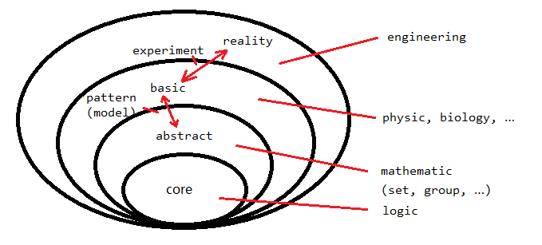

``` org
** 何为幻想体系
   空想科学
   dream room production
   剖析-构筑的层次（logic-math-…）

** 剖析
*** 大致框架
    TODO 补图
   - core
     逻辑/形式系统
     50%-yes 50%-no ?
   - abstract
     - 集合
     - 群（运算/函数）
       函数也是数据
   - basic
     - 观测/物理/化学/生物/...
   - experiemnt-->reality
     - 工程
       pattern
     - 艺术/社会科学
   - 描述/语言/language
     也是一种形式系统，metadata/primitive
*** 理解
    推理/形式系统/逻辑/语言/集合/群，其可能的关系（关于语言为什么排在这么core的位置，可以看sicp）
    推理+形式系统 --> 集合 --> 群 --> 
                  |-----------------> 逻辑/语言
    无论是什么关系，总有一个core，从core又可以推理出以上这些基础，而 集合/群 --> 数学 --> 其他科学 --> 工程 这条通路应该是没有问题的
    对于数学以下（以下=以及之下），可以粗略的认为是abstract中的core（待有能力再对其做研究，暂且当作黑盒），以数学为核心进行构筑（不同世界的构筑）其他科学
    - 理论
      数学中的 代数/几何/...
      - 物理
        - 力学
          坐标/极限
          - 宏观
          - 微观
            概率
      - 化学
        构筑在物理之上（物理化学）？
    - 实验
      数学中的 概率/统计/...
      - 生物
        没有理论生物，只有实验生物（从依赖的数学角度看）
      - 化学
      - 物理
        观测？

** 幻想体系例子
  现有的（游戏等）分析
    - 符合理论，但现实中无法实现（工程原因）
    - 另外一套理论
    - 不符合理论（构筑失败）
  从最基础的开始构筑，括号内是维度
  宇宙（3）——>多元宇宙集（相同法则，连续，易穿梭）（6）——>近似宇宙集（法则近似，连续，难穿梭）（9）——>宇宙集合（法则完全不一样，离散，几乎不可能穿梭）（12）——>the-dark-tower
  熵增系统——>能量逸散？——>推出宇宙集中间的？生成新宇宙
*** 神秘侧，科技侧
    无论怎么样，一个 技能 要造成 伤害 需要经过以下过程（参考《旧日篇章》模块部分） 
    攻击侧：能源--转化--输出
    防守侧：闪避--抵抗--受伤
    攻击侧和防守侧为多对多
    依次分析
            | 神秘侧 | 科技侧
    能源| 魔法/精神（非物理能量） | 电池/生物（物理能量：电能/生物质能）
    转化| 魔网/灵能/仙术（不可见黑箱） | 机械/肌肉（做功/转化）
    输出| 精神/灵魂/同科技侧（独特的点是针对神秘侧独有的结构破坏，其余同科技侧） | 子弹/激光/生体飞弹/切割（动能/热能等对生物/分子结构的破坏）
    闪避| 护盾/虚无（神秘侧必中较多（毕竟神秘/因果律武器）） | 盾牌/躲闪（阻止其作用）
    抵抗| 对应的抗性（各种免疫） | 硬度/结构稳定性/再生（结构破坏难易程度）
    本质上一样，攻击都是为了破坏结构，使其不能工作，防御都是为了降低被破坏导致失去功能的可能，多对多的特性丰富选择的难度
*** brain-storm
    多元宇宙，集合，哲学问题思想实验归类，时间不存在-->只有因果（卡车悖论？）
    01. 特休斯之船与save/load，纳米生物，cyberpunk
    02. 多元宇宙穿越与三个我（本我超我）
    03. 博弈？魔女与魔法师（男-30岁前嘿嘿嘿-无法成为魔法师，女-30岁前嘿嘿嘿-才能成为魔女）
    04. 气世界，KAI（kensai），武侠？仙侠？
    05. 火与雾，steampunk
    06. 元素世界，元素上色学，元素构造学（骨头=土＋ 生命，血=水＋生命，肉=土＋水＋生命，脑子 =雷＋生命）
    07. 脊椎寄生虫-->zombie
    08. emacs与vi的战争，new一个
    09. 法则完备集
    10. 分层结构，科学家分为思想者&实现者；第一次革命（力量的不对等，实现者win），第二次革命（家庭束缚，镇压，实现者win），第三次革命（0号元素的发现，心灵异能，draw），思想者进化（纯脑子？），第四次革命（种族战争，主角乱入？）
    11. 性别之战，sex is about power（恶魔的诅咒，神的样子，神与恶魔，语言是什么）
    12. 必胜的败局，博弈论与概率论
    13. 现代（骷髅主角的死法），骷髅（被巨魔法师拉起来，不是唯一的骷髅，拉起来的原因－知识记忆，巨魔法师的故事－奥术与蒸汽，不可定位性），异界（新世界，可定位，巨魔法师占领－实现愿望），跟虫兽（怪猎模式，灵魂&意识的根本－雷元素，个体意识与意识网络），元素生命穿越至现实－纳米机器人
    14. 男女交配为什么女方是弱势群体：一方面是痕迹（刻刀与橡皮泥？催产素？），一方面是力量（power？）；炮友-解决生理问题，抛开痕迹不谈，但力量？这是上半身和下半身的对抗（感情？需求？互相影响？）！往往以上半身失败而告终？
    15. 逆转td模式，扣血变加血（增加路程变减少路程-加速，传送）：守护者（顾客）持续受到攻击，补血物品（食物）经过特定路线（食物传送带）至守护者，回血效果可以通过“攻击”（料理）增加；合作对抗模式：4家塔防，借钱，积分独立，只有积分最高的获胜，不借钱赢不了，多种借钱方式；有角色是卧底，跟别人相反（借到一次基本就赢了？）模式是加血模式？卧底是扣血？
    16. 法术电路，能源=蓝条，控制模块=开关？放大器？，激发模块=用电模块？，元素转化模块=用电模块？模块+元素解释魔法（原理，复杂程度，等级，魔网），串并联，超魔，施法距离；eg. 蓝条-元素转化模块（火）-元素控制模块（附着）=火焰之手；级联衰减，并联不稳定，法术反噬的多个阶段
    17. 克隆人（罐装人），速成克隆人导致灵魂大量涌入，劣币驱逐良币，深渊的最大危机，恐惧的原因（未知？生命？伤害？）
    18. 维棋，暗黑塔，宇宙为旗子（游戏王，陷阱卡，宇宙内对抗），模块（宇宙到卡牌的过程，自行组成）和耗费（可计算，防止谁屌说谁就屌）

```